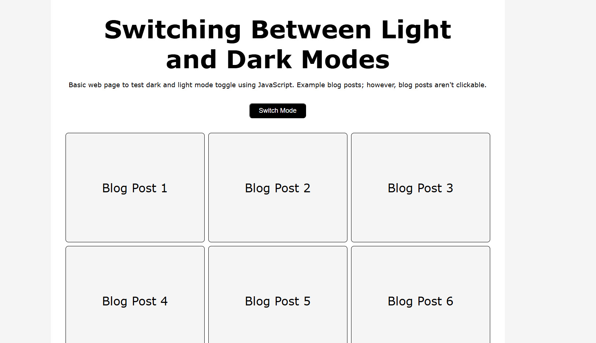

# Coding Challenge as part of an online coding diploma I'm doing

## Content

This one of a series of coding challenges I've completed while doing a Coding Diploma course with [Itonlinelearning](https://www.itonlinelearning.com/).

## Activity: Dark and Light Mode Page template

## Objective:

Create a web application that demonstrates DOM manipulation techniques using JavaScript by creating a templating system that changes the styles of the web page from a dark mode to a light mode based on the users interactions.

## Features

- Light mode and dark mode styles activated on click of a button

## Files

- `index.html`: Contains the HTML structure and content of the webpage.
- `styles.css`: Contains the CSS styles for both light and dark modes.
- `script.js`: Contains the JavaScript code for DOM manipulation and mode toggling.
- `README.md`: Provides an overview of the project and its features.

## How to Use

1. Open the `index.html` file in a web browser.
2. Click the Witch Mode button to switch between light and dark modes.

## JavaScript Code Explanation

- The `toggleButton` variable selects the toggle button element.
- The `toggle` function toggles the `dark-mode` class on all relevant elements.
- An event listener is added to the toggle button to call the `toggle` function when the button is clicked.
